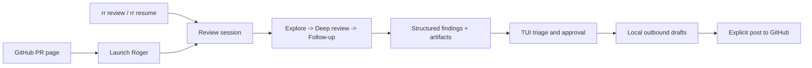

# Roger Reviewer

> Local-first pull request review with durable sessions, structured findings,
> and explicit human approval before anything goes back to GitHub.

| Status | Stage |
| --- | --- |
| Product maturity | Planning and bead-polishing |
| Release status | In development, not a release |
| Current versioning | `0.0.x` development builds |
| Planned versioning | CalVer once the project is shipping real releases |
| Default mode | Review-only, not auto-fix |
| Source of truth | Local state |
| Primary surfaces | CLI, TUI, GitHub launch surface |

Roger Reviewer is not at `v1.0` yet. This repository is still in active
planning and early development, and nothing here should be treated as a stable
release artifact.

Roger Reviewer is a local-first review system built around one core idea:
review quality improves when findings, prompts, evidence, and follow-up survive
beyond a single terminal run.

Instead of treating review as disposable chat output, Roger Reviewer aims to:

- keep review sessions durable and resumable
- preserve a real fallback into plain OpenCode
- make findings first-class objects with state and evidence
- route any GitHub mutation through an explicit approval step

## Why It Exists

Most review tooling is optimized for one-shot output. Roger Reviewer is being
designed for continuity:

- start from the shell or a GitHub PR page
- run staged review passes instead of one monolithic prompt
- triage findings in a TUI-first workflow
- draft outbound comments locally
- post only after explicit human approval



## Product Shape

| Surface | Role |
| --- | --- |
| `rr` CLI | Start, resume, inspect, and refresh review sessions |
| Rust TUI | Main workflow for triage, follow-up, and approval |
| Browser extension | GitHub-side launch surface for local review flows |
| Local store | Durable sessions, findings, artifacts, and audit history |

## Non-Negotiable Constraints

- No automatic GitHub posting.
- No automatic bug-fixing by default.
- No hidden daemon at the center of the architecture.
- No fake fallback story: every Roger session must map back to a usable
  underlying OpenCode session.
- Mutation-capable flows must be explicit and visibly elevated.

## Current Repo Contents

The repository is intentionally early. At the moment, it contains planning
artifacts rather than implementation packages.

| Path | Purpose |
| --- | --- |
| [`AGENTS.md`](AGENTS.md) | Operating contract for coding agents in this repo |
| [`docs/PLAN_FOR_ROGER_REVIEWER.md`](docs/PLAN_FOR_ROGER_REVIEWER.md) | Canonical product and architecture plan |
| [`docs/BEAD_SEED_FOR_ROGER_REVIEWER.md`](docs/BEAD_SEED_FOR_ROGER_REVIEWER.md) | Seed structure for the bead graph |
| [`docs/CRITIQUE_ROUND_01_FOR_ROGER_REVIEWER.md`](docs/CRITIQUE_ROUND_01_FOR_ROGER_REVIEWER.md) | First critique and integration round |
| [`docs/CRITIQUE_ROUND_02_FOR_ROGER_REVIEWER.md`](docs/CRITIQUE_ROUND_02_FOR_ROGER_REVIEWER.md) | Second critique round focused on architecture risk |
| [`docs/CRITIQUE_ROUND_03_FOR_ROGER_REVIEWER.md`](docs/CRITIQUE_ROUND_03_FOR_ROGER_REVIEWER.md) | Third critique round focused on Rust-first local architecture and Native Messaging |
| [`docs/PLANNING_WORKFLOW_PROMPTS.md`](docs/PLANNING_WORKFLOW_PROMPTS.md) | Prompts for critique, integration, and readiness loops |
| [`docs/DEV_MACHINE_ONBOARDING.md`](docs/DEV_MACHINE_ONBOARDING.md) | Practical machine setup guide for Codex, Agent Mail, and planning workflow access |
| [`.beads/issues.jsonl`](.beads/issues.jsonl) | Tracked planning graph in export form |
| [`roger-reviewer-brain-dump.md`](roger-reviewer-brain-dump.md) | Raw intent source document |

## Current Draft Architecture

```text
.
├── apps/
│   ├── cli/
│   ├── extension/
│   └── tui/
├── packages/
│   ├── app-core/
│   ├── config/
│   ├── github-adapter/
│   ├── prompt-engine/
│   ├── session-opencode/
│   ├── storage/
│   └── worktree-manager/
├── docs/
├── _exploration/
└── .beads/
```

## Near-Term Milestones

1. Finish architecture reconciliation, bead polishing, and readiness review.
2. Lock the harness boundary and TUI/app-core or Rust-first ownership decision.
3. Confirm the daemonless GitHub bridge, including the Edge story.
4. Start implementation only after the planning gate passes.

## Read Next

- [`docs/PLAN_FOR_ROGER_REVIEWER.md`](docs/PLAN_FOR_ROGER_REVIEWER.md)
- [`docs/ALIEN_ARTEFACTS_FOR_ROGER_REVIEWER.md`](docs/ALIEN_ARTEFACTS_FOR_ROGER_REVIEWER.md)
- [`docs/PLANNING_WORKFLOW_PROMPTS.md`](docs/PLANNING_WORKFLOW_PROMPTS.md)
- [`docs/DEV_MACHINE_ONBOARDING.md`](docs/DEV_MACHINE_ONBOARDING.md)
- [`AGENTS.md`](AGENTS.md)
