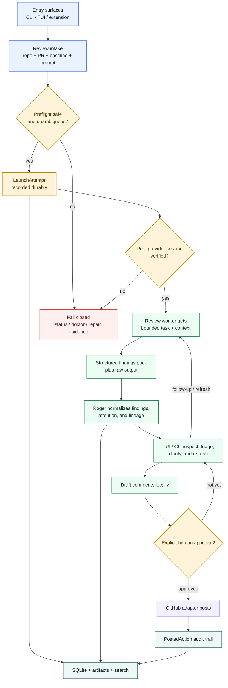

# Roger Reviewer

<div align="center">


<p><strong>Local-first pull request review for GitHub.</strong></p>
<p>Durable sessions, structured findings, explicit approval gates, and an optional PR-page companion.</p>
<p><a href="#install">Install</a> · <a href="#quickstart">Quickstart</a> · <a href="#commands">Commands</a> · <a href="#blessed-paths">Blessed Paths</a> · <a href="#architecture">Architecture</a> · <a href="#contributing">Contributing</a></p>

</div>

Roger Reviewer turns pull request review into a durable local workflow. Start
from the shell or a GitHub pull request page, keep findings and drafts local,
and approve before anything is posted back to GitHub.

This README tracks the public `0.1.0` product shape and the blessed workflows
we intend to support publicly. The deeper planning and implementation contracts
live under [`docs/`](docs/).

## Why Roger Reviewer

Most review tools are easy to start and hard to continue. Findings disappear
into scrollback, follow-up context fragments across sessions, and the line
between "drafted locally" and "posted remotely" is often too blurry.

Roger takes a different position:

- local state is authoritative
- the terminal and TUI are the primary review surfaces
- the browser companion is optional
- GitHub writes stay behind an explicit approval gate
- the underlying coding session remains a real fallback path

## Install

Roger ships through GitHub Releases. That is the public install surface.

### macOS

```bash
curl -fsSL https://github.com/cdilga/roger-reviewer/releases/latest/download/rr-install.sh | bash
```

### Linux

```bash
curl -fsSL https://github.com/cdilga/roger-reviewer/releases/latest/download/rr-install.sh | bash
```

### Windows (PowerShell)

```powershell
& ([scriptblock]::Create((Invoke-WebRequest -UseBasicParsing 'https://github.com/cdilga/roger-reviewer/releases/latest/download/rr-install.ps1').Content))
```

If you want a pinned release instead of `latest`, use the tagged installer
assets from [GitHub Releases](https://github.com/cdilga/roger-reviewer/releases).

## Quickstart

The local-first path is the primary Roger experience.

### 1. Start a review

```bash
rr review --pr 123 --provider opencode
```

### 2. Inspect what Roger found

```bash
rr status
rr findings
```

### 3. Continue the same review later

```bash
rr resume --pr 123
rr refresh --pr 123
```

Replace `123` with your pull request number. For `0.1.0`, the intended provider
order is GitHub Copilot CLI, OpenCode, Codex, Gemini, then Claude Code.
OpenCode remains the continuity reference path, and the browser companion is
optional.

## Commands

| Command | What it does |
| --- | --- |
| `rr review --pr 123 --provider opencode` | Start a review for a pull request |
| `rr resume --pr 123` | Re-enter the existing review for that pull request |
| `rr status` | Show the current session, attention state, and next step |
| `rr findings` | Inspect the structured findings Roger has materialized |
| `rr sessions` | List local review sessions |
| `rr refresh --pr 123` | Reconcile the review after new commits land |
| `rr return --pr 123` | Return from the underlying coding session to Roger |
| `rr extension setup --browser edge` | Set up the optional browser companion |
| `rr extension doctor --browser edge` | Verify the browser companion path |

## Blessed Paths

### 1. Local-first review

Install `rr`, start from the repo, and do the real review work locally. This is
the primary Roger path.

### 2. Browser-assisted launch

The browser companion is for convenience, not authority. It helps you start or
resume from a PR page, but Roger's local state remains the source of truth.

### 3. Local draft, explicit approval, remote post

Roger drafts locally first, asks for explicit approval second, and only then
posts back to GitHub.

### 4. Underlying session fallback

Roger sessions stay tied to an underlying coding session so the fallback path
remains real instead of decorative.

## What Roger Refuses To Do

- post review comments automatically
- fix code automatically by default
- hide mutation-capable actions inside ordinary navigation
- require a long-running daemon as the center of the system

## Architecture

Roger is built around one shared local core. The CLI, TUI, and browser
companion are surfaces over that core, not separate products with separate
truth.



At the top level:

- `rr` owns the review lifecycle, approval model, and posting boundary
- findings, artifacts, and search stay local
- the review worker runs a bounded task inside a provider session
- GitHub is a target surface, not Roger's source of truth

For the fuller architecture and diagram pack, see
[`docs/ROOT_LEVEL_FLOW_AND_ARCHITECTURE_DIAGRAMS.md`](docs/ROOT_LEVEL_FLOW_AND_ARCHITECTURE_DIAGRAMS.md)
and
[`docs/PLAN_FOR_ROGER_REVIEWER.md`](docs/PLAN_FOR_ROGER_REVIEWER.md).

## Browser Companion

Roger's browser companion is optional and launch-oriented.

- supported browsers: Chrome, Edge, and Brave
- normal setup path: `rr extension setup --browser <edge|chrome|brave>`
- verification path: `rr extension doctor --browser <edge|chrome|brave>`
- the browser lane is for launch and resume convenience; approval and posting
  stay local and explicit

## Contributing

Roger Reviewer accepts Issues, not Pull Requests.

If you found a bug, want a feature, or want to challenge a workflow or product
assumption, open an issue first:

- [Open an issue](https://github.com/cdilga/roger-reviewer/issues)
- [Contribution policy](CONTRIBUTING.md)

## Docs

- [Canonical plan](docs/PLAN_FOR_ROGER_REVIEWER.md)
- [Architecture diagrams](docs/ROOT_LEVEL_FLOW_AND_ARCHITECTURE_DIAGRAMS.md)
- [TUI workspace contract](docs/TUI_WORKSPACE_AND_OPERATOR_FLOW_CONTRACT.md)
- [Harness session linkage contract](docs/HARNESS_SESSION_LINKAGE_CONTRACT.md)

## License

[MIT](LICENSE)
