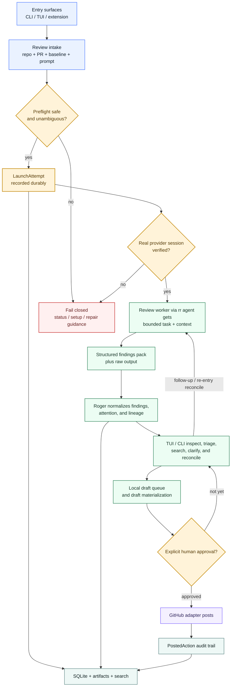

# Roger Reviewer

<div align="center">


<p><strong>Local-first pull request review for GitHub.</strong></p>
<p>Durable sessions, structured findings, explicit approval gates, and an optional PR-page launch companion.</p>
<p><a href="#install">Install</a> · <a href="#quickstart">Quickstart</a> · <a href="#commands">Commands</a> · <a href="#blessed-paths">Blessed Paths</a> · <a href="#architecture">Architecture</a> · <a href="#contributing">Contributing</a></p>

</div>

Roger Reviewer turns pull request review into a durable local workflow. Start
from the shell or a GitHub pull request page, keep findings and drafts local,
and approve before anything is posted back to GitHub.

This README tracks the current live `rr` CLI surface and the blessed workflows
we support publicly. The deeper planning and implementation contracts live
under [`docs/`](docs/).

**Versioning:** `0.3` is the current product milestone. Published releases are
CalVer-tagged (`vYYYY.MM.DD`), while the Cargo workspace semver stays `0.1.0`.
The milestone names the communication line; the CalVer tag is the release
identity. See
[`docs/RELEASE_CALVER_VERSIONING_CONTRACT.md`](docs/RELEASE_CALVER_VERSIONING_CONTRACT.md)
for the canonical version authority.

## Why Roger Reviewer

Most review tools are easy to start and hard to continue. Findings disappear
into scrollback, follow-up context fragments across sessions, and the line
between "drafted locally" and "posted remotely" is often too blurry.

Roger takes a different position:

- local state is authoritative
- the terminal and TUI are the primary review surfaces
- the browser companion is optional
- GitHub writes stay behind an explicit approval gate
- the underlying coding session remains a real fallback path

## Install

Roger ships through GitHub Releases. That is the public install surface.

### macOS / Linux

```bash
curl -fsSL https://github.com/cdilga/roger-reviewer/releases/latest/download/rr-install.sh | bash
```

### Windows (PowerShell)

```powershell
& ([scriptblock]::Create((Invoke-WebRequest -UseBasicParsing 'https://github.com/cdilga/roger-reviewer/releases/latest/download/rr-install.ps1').Content))
```

If you want a pinned release instead of `latest`, use the tagged installer
assets from [GitHub Releases](https://github.com/cdilga/roger-reviewer/releases).

### Source Build / Contributor Toolchain

Roger's source tree is pinned to the Rust `nightly` channel through
[`rust-toolchain.toml`](rust-toolchain.toml). The workspace language edition
remains `2024` because the Rust edition and the compiler channel are separate
settings.

Minimal contributor setup:

```bash
rustup update nightly
cargo --version
cargo test --workspace --all-targets
```

Run those commands from the repo root so Cargo picks up the repo-local nightly
override automatically.

## Quickstart

The local-first path is the primary Roger experience.

### 1. Run provider-aware preflight

Roger's local store bootstraps automatically on first use, so there is no
required init step (`rr init` remains available as an explicit, idempotent
bootstrap).

```bash
rr doctor --provider opencode
```

### 2. Start a review

```bash
rr review --pr 123 --provider opencode
```

### 3. Inspect what Roger found

```bash
rr status
rr findings
rr open
```

`rr open` (compatibility alias: `rr tui`) opens the keyboard-driven review
cockpit: sessions, findings triage, draft approval queue, timeline, and
prior-review search in one place. The cockpit drives the full review loop —
`n` starts a new review from the open-PR queue, `r` resumes a session, `b`
drafts findings into an outbound batch, and approved batches post to GitHub
behind a typed elevated confirmation — through the same gated command paths
as the CLI, robot, and extension surfaces.

### 4. Continue the same review later

```bash
rr review --resume --pr 123
```

`rr review --resume` re-enters an existing review (compatibility alias:
`rr resume --pr 123`).

Replace `123` with your pull request number. In the live CLI surface,
`rr review --provider` accepts `opencode`, `codex`, `gemini`, and `claude` by
default, and exposes `copilot` only when `RR_ENABLE_COPILOT_PROVIDER=1` is set.

- **OpenCode** is the first-class provider and the recommended default: the only
  live Tier B continuity path, with start, reseed, locator reopen, and
  `rr return`. The quickstart uses `--provider opencode`.
- **Codex, Gemini, and Claude Code** are bounded Tier A providers. Roger can
  start a review, reseed from a `ResumeBundle`, and preserve raw capture, but it
  does not claim locator reopen or `rr return` for them.
- **GitHub Copilot CLI** is a feature-gated opt-in (`RR_ENABLE_COPILOT_PROVIDER=1`).
  When enabled, Roger can start a review, reopen by locator or session id, return
  with `rr return`, and fall back to honest `ResumeBundle` reseed when reopen is
  stale or unusable. It is disabled by default and is not part of the default
  public live claim.
- **pi-agent** is not part of the live `rr review` surface.

The browser companion is optional.

The Roger store lives at `~/.roger` (one canonical store per profile; override
with `RR_STORE_ROOT`). `rr doctor` verifies local bootstrap and provider
prerequisites, but auth remains a deferred first-launch check; run
`rr review`/`rr resume` to verify auth/path fail-closed behavior.

Roger reconciles stale review state when you re-enter through `rr review`,
`rr resume`, or `rr return`. `rr status` and `rr findings` are persisted
readback surfaces: they show the last recorded Roger state, warn when target
drift means you should re-enter or start a fresh pass, and do not imply
background reconciliation that has not happened.

For the current Copilot operator contract, including the exact gate,
preflight assets, Roger-imposed restrictions, and locally recorded continuity
artifacts, see [docs/DEV_MACHINE_ONBOARDING.md](docs/DEV_MACHINE_ONBOARDING.md).

## Commands

Roger's operator surface is intentionally organized around a small set of
verbs: check the environment, choose work, review, inspect, and send only after
explicit approval. Older exact command names remain supported as compatibility
aliases where noted.

Preferred names come first; the older exact command names shown in parentheses
remain fully supported compatibility aliases and route to the same handlers.

| Command (compatibility alias) | What it does |
| --- | --- |
| `rr doctor --provider opencode` | Run local + provider preflight checks with fail-closed guidance |
| `rr queue` (`rr prs`) | List open pull requests as a review queue joined with local Roger state |
| `rr review --pr 123 --provider opencode` | Start a review for a pull request |
| `rr review --resume --pr 123` (`rr resume --pr 123`) | Re-enter the existing review for that pull request |
| `rr open` (`rr tui`) | Open the local review cockpit (PR queue launch, sessions, findings, drafts, approve/post, timeline, search) |
| `rr status` | Show the current session, attention state, and next step |
| `rr findings` | Inspect the structured findings Roger has materialized |
| `rr findings --query "auth"` (`rr search --query "auth"`) | Search prior local review memory and evidence |
| `rr findings --sessions` (`rr sessions`) | List local review sessions; mostly useful for automation and recovery |
| `rr send triage --finding <id> --state accepted` (`rr triage ...`) | Record your local triage decision on a finding |
| `rr send draft --finding <id>` (`rr draft ...`) | Materialize a local outbound draft batch from accepted findings |
| `rr send approve --batch <id>` (`rr approve ...`) | Record a local approval token for one exact draft batch |
| `rr send post --batch <id>` (`rr post ...`) | Post one approved batch to GitHub and record the audit trail |
| `rr return --pr 123` | Rebind a dropped-out bare OpenCode or feature-gated Copilot session back to Roger |
| `rr setup update` (`rr update`) | Self-update `rr` from the latest published GitHub release |
| `rr setup fetch` (`rr extension fetch`) | Download and verify the published extension package for this release |
| `rr setup extension --browser edge` (`rr extension setup ...`) | Set up the optional browser companion |
| `rr setup doctor --browser edge` (`rr extension doctor ...`) | Verify the browser companion path |
| `rr setup assets install` (`rr assets install`) | Install and verify local semantic-search assets |
| `rr api docs schemas` (`rr robot-docs schemas`) | Machine-readable command and schema reference |
| `rr init` | Optional explicit bootstrap; the store auto-creates on first use |

## Blessed Paths

### 1. Local-first review

Install `rr`, start from the repo, and do the real review work locally. This is
the primary Roger path.

`rr return` is narrower than `rr resume`. Use it only after you intentionally
drop out of Roger into a bare harness session and want Roger to rebind that
work back to the original review session. If you are already in a normal
Roger-managed session, you usually want `rr resume` or just to keep working in
that session. `rr return` is blessed on the OpenCode Tier B continuity path and
on the feature-gated Copilot Tier B continuity path enabled with
`RR_ENABLE_COPILOT_PROVIDER=1`; Codex, Gemini, and Claude should still fail
closed rather than pretend to support it.

### 2. Browser-assisted launch

The browser companion is for convenience, not authority. It helps you start or
resume from a PR page and can show bounded mirror state only when the bridge
readback is truthful, but Roger's local state remains the source of truth.

### 3. Local triage, local draft, explicit approval, remote post

Findings materialize locally as `new`. You triage them (`rr triage --state
accepted`), draft locally from accepted findings, approve explicitly, and only
then does Roger post back to GitHub. Each step fails closed on stale state.

### 3a. Review queue

`rr prs` lists the repository's open pull requests joined with your local
Roger session state (`not_started`, `in_review`, `needs_attention`, `drafted`,
`posted`) and suggests the next command per PR. It is read-only and is the
starting point for batching review work across a repo.

### 4. Underlying session fallback

Roger sessions stay tied to an underlying coding session so the fallback path
remains real instead of decorative.

## What Roger Refuses To Do

- post review comments automatically
- fix code automatically by default
- hide mutation-capable actions inside ordinary navigation
- require a long-running daemon as the center of the system

## Architecture

Roger is built around one shared local core. The CLI, TUI, and browser
companion are surfaces over that core, not separate products with separate
truth.


```mermaid
flowchart TD
    classDef entry fill:#EAF2FF,stroke:#4F7CFF,color:#102033,stroke-width:1.4px;
    classDef gate fill:#FFF3D9,stroke:#C68A00,color:#5B3A00,stroke-width:1.7px;
    classDef core fill:#ECFDF3,stroke:#2F855A,color:#173A28,stroke-width:1.4px;
    classDef data fill:#EEF8F6,stroke:#4C7A78,color:#102322,stroke-width:1.2px;
    classDef blocked fill:#FFF0F0,stroke:#CB3A3A,color:#6B1F1F,stroke-width:1.6px;
    classDef external fill:#F4F0FF,stroke:#7B61FF,color:#2D225E,stroke-width:1.3px;

    ENTRY["Entry surfaces<br/>CLI / TUI / extension"]:::entry
    INTAKE["Review intake<br/>repo + PR + baseline + prompt"]:::entry
    PREFLIGHT{"Preflight safe<br/>and unambiguous?"}:::gate
    ATTEMPT["LaunchAttempt<br/>recorded durably"]:::gate
    VERIFY{"Real provider session<br/>verified?"}:::gate
    WORKER["Review worker via rr agent gets<br/>bounded task + context"]:::core
    PACK["Structured findings pack<br/>plus raw output"]:::core
    NORMALIZE["Roger normalizes findings,<br/>attention, and lineage"]:::core
    INSPECT["TUI / CLI inspect, triage,<br/>search, clarify, and reconcile"]:::core
    DRAFT["Local draft queue<br/>and draft materialization"]:::core
    APPROVE{"Explicit human approval?"}:::gate
    POST["GitHub adapter posts"]:::external
    AUDIT["PostedAction audit trail"]:::data
    STORE["SQLite + artifacts + search"]:::data
    BLOCK["Fail closed<br/>status / setup / repair guidance"]:::blocked

    ENTRY --> INTAKE --> PREFLIGHT
    PREFLIGHT -- no --> BLOCK
    PREFLIGHT -- yes --> ATTEMPT
    ATTEMPT --> STORE
    ATTEMPT --> VERIFY
    VERIFY -- no --> BLOCK
    VERIFY -- yes --> WORKER --> PACK --> NORMALIZE --> INSPECT
    NORMALIZE --> STORE
    INSPECT -- follow-up / re-entry reconcile --> WORKER
    INSPECT --> DRAFT --> APPROVE
    APPROVE -- not yet --> INSPECT
    APPROVE -- approved --> POST --> AUDIT --> STORE
```

At the top level:

- `rr` owns the review lifecycle, approval model, and posting boundary
- findings, artifacts, and search stay local
- the review worker runs a bounded `rr agent` task inside a verified provider session
- the browser companion is limited to launch and bounded mirror readback
- GitHub is a target surface, not Roger's source of truth

For the fuller architecture and diagram pack, see
[`docs/ROOT_LEVEL_FLOW_AND_ARCHITECTURE_DIAGRAMS.md`](docs/ROOT_LEVEL_FLOW_AND_ARCHITECTURE_DIAGRAMS.md)
and
[`docs/PLAN_FOR_ROGER_REVIEWER.md`](docs/PLAN_FOR_ROGER_REVIEWER.md).

## Browser Companion

Roger's browser companion is optional and bounded.

- supported browsers: Chrome, Edge, and Brave
- supported bridge: Native Messaging only
- normal setup path: `rr extension setup --browser <edge|chrome|brave>`
- verification path: `rr extension doctor --browser <edge|chrome|brave>`
- installed (non-dev) hosts: the installer unpacks the release extension
  package into `~/.roger/bridge/extension-package/<version>/`, and
  `rr extension fetch` re-downloads and checksum-verifies it on demand; no
  Roger source checkout is required
- browser truth note: branded Google Chrome 137+ ignores `--load-extension`,
  so Chrome needs one manual "Load unpacked" pass via `chrome://extensions`;
  Edge 150+ ignores it too, so Edge needs the same one manual "Load
  unpacked" pass via edge://extensions; Brave still honored the flag-based
  launch at last verification
- the browser lane is for launch, resume, and bounded mirror convenience;
  approval and posting stay local and explicit

## Contributing

Roger Reviewer uses an issue-first contribution path: open an issue before
sending code so scope, support claims, and validation expectations are clear.
See [CONTRIBUTING.md](CONTRIBUTING.md) for the full policy and contributor
toolchain setup.

## Docs

User-facing docs:

- [Dev machine onboarding](docs/DEV_MACHINE_ONBOARDING.md) — setup and the
  Copilot operator contract
- [Testing doctrine](docs/TESTING.md)
- [Release / CalVer versioning contract](docs/RELEASE_CALVER_VERSIONING_CONTRACT.md)

Internal implementation contracts (deep planning and design references, not
getting-started material):

- [Canonical plan](docs/PLAN_FOR_ROGER_REVIEWER.md) (~183KB design contract)
- [Architecture diagrams](docs/ROOT_LEVEL_FLOW_AND_ARCHITECTURE_DIAGRAMS.md)
- [TUI workspace contract](docs/TUI_WORKSPACE_AND_OPERATOR_FLOW_CONTRACT.md)
- [Harness session linkage contract](docs/HARNESS_SESSION_LINKAGE_CONTRACT.md)

`AGENTS.md` is the primary operating contract for agents working in this repo.

## License

[MIT](LICENSE)
