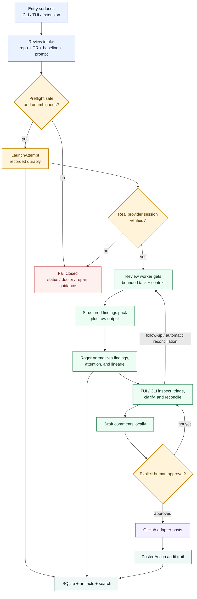
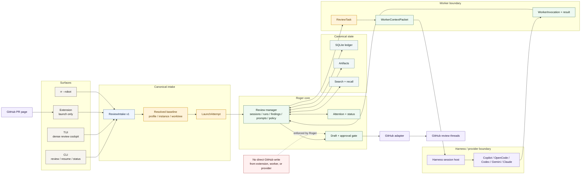
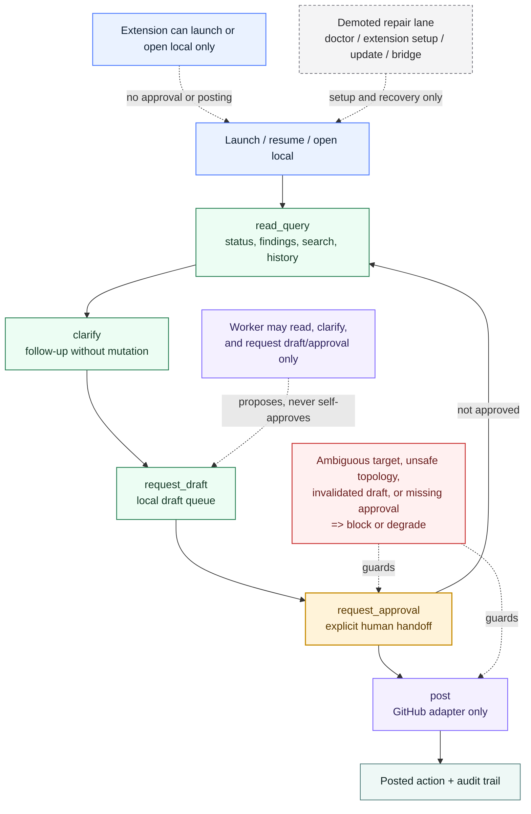

# Root-Level Flow And Architecture Diagrams

Status: Visual support doc for `0.1.x`  
Audience: operators, maintainers, and implementers who need a fast, truthful
top-level map of Roger Reviewer before diving into the canonical plan or
support contracts  
Scope: README-grade core review flow, software-architecture hierarchy, and the
elevation ladder that separates read-mostly review work from explicit outbound
mutation

---

## Purpose

This document is the small top-level diagram pack for Roger Reviewer.

It exists to answer three questions quickly:

1. what the core review loop is
2. how the major software layers and boundaries relate to each other
3. where Roger deliberately elevates actions such as approval and posting

This doc is visual support, not a replacement for the canonical plan.

Authority rule:

- if a diagram conflicts with
  [`PLAN_FOR_ROGER_REVIEWER.md`](PLAN_FOR_ROGER_REVIEWER.md) or a narrower
  support contract, the canonical prose wins
- diagrams here should compress stable truths that already exist elsewhere, not
  invent new product semantics

---

## What belongs at root level

Not every Roger flow benefits from a root-level Mermaid diagram.

| Concern | Mermaid value | Root-level now? | Why |
|---|---|---|---|
| Core review lifecycle | High | Yes | This is the main README-visible story: launch, review, triage, draft, approve, post. |
| Architecture hierarchy | High | Yes | Roger is defined by boundaries and ownership splits more than by package lists. |
| Elevation ladder | High | Yes | Approval and posting are explicit product constraints, not footnotes. |
| Browser setup and doctor | Medium | Later | Important, but secondary to the main product story and better kept near extension docs. |
| Worktree/isolation topology | Medium | Later | Useful, but belongs closer to config and preflight docs than to the root-level narrative. |
| Attention-state taxonomy | Medium | Later | Important for surfaces, but too detailed for the first-look diagram pack. |
| Prompt/worker invocation lifecycle | Medium | Later | Valuable for implementation docs, but not the first thing most readers need. |
| Update/install mechanics | Low at root level | No | Important operationally, but not part of Roger's core review identity. |

Chosen direction:

- one restrained README hero diagram for the core review loop
- two companion diagrams in docs: architecture hierarchy and elevation ladder
- explicit gates use a warmer accent
- repair and demoted paths stay visually muted rather than competing with the
  main product path

---

## Diagram 1: Core Review Loop

This is the most important diagram in the repo. The README should carry this
exact flow as a first-class artifact because it captures the core product
promise without collapsing into setup or implementation detail.

Why this stays small:

- it shows explicit launch truth, not synthetic success
- it keeps the worker bounded and Roger-owned
- it makes approval a first-class gate
- it shows that GitHub posting is downstream of local review, not parallel to it

---

## Diagram 2: Architecture Hierarchy

This diagram answers the software-architecture question: who owns what, and how
the major surfaces and boundaries relate.

Why this matters:

- it makes the manager/worker/provider split legible
- it keeps the extension in its bounded launch role
- it shows canonical Roger state as local and authoritative
- it keeps GitHub write ownership behind the explicit approval lane

---

## Diagram 3: Elevation Ladder

This diagram is not mainly about time. It is about permission, ownership, and
which actions are deliberately elevated.

What this diagram protects against:

- treating draft approval as an implementation detail
- making the extension look like it owns review mutation
- letting repair/admin surfaces dominate the product story
- blurring the difference between “the worker proposed it” and “Roger posted it”

---

## Keep These In Sync

If the root-level story changes, update these diagrams when the underlying
canonical truth changes in one of these docs:

- [`PLAN_FOR_ROGER_REVIEWER.md`](PLAN_FOR_ROGER_REVIEWER.md)
- [`ROUND_05_SURFACE_RECONCILIATION_BRIEF.md`](ROUND_05_SURFACE_RECONCILIATION_BRIEF.md)
- [`REVIEW_WORKER_RUNTIME_AND_BOUNDARY_CONTRACT.md`](REVIEW_WORKER_RUNTIME_AND_BOUNDARY_CONTRACT.md)
- [`ATTENTION_EVENT_AND_NOTIFICATION_CONTRACT.md`](ATTENTION_EVENT_AND_NOTIFICATION_CONTRACT.md)
- [`CONFIGURATION_CAPABILITY_AND_DEFAULTING_CONTRACT.md`](CONFIGURATION_CAPABILITY_AND_DEFAULTING_CONTRACT.md)

If a diagram starts needing too many notes, split it into a narrower
surface-specific diagram instead of inflating the root-level pack.
